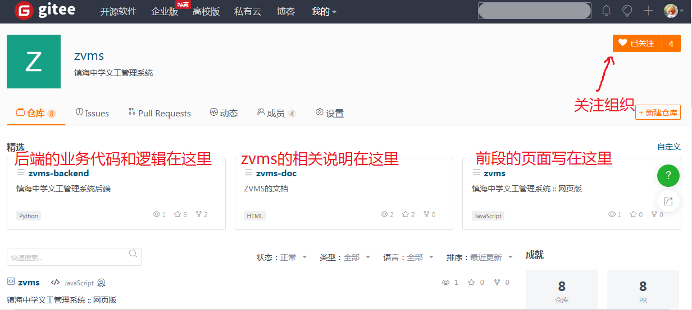

# 加入我们

如果你有项目开发的经历，或者想帮助我们测试出软件的`bug`，或者仅仅是想要获得义管会的奖励，这个页面会指示你参与项目发展。

## 获取一个账号

在[Gitee](https://gitee.com)注册一个账号即可

## 找到zvms的项目

打开zvms组织的[网址](https://gitee.com/zvms)

## 如果你想报告软件的bug

进入一个代码仓库（这里以`zvms-backend`为例），

（你也可以在发布`issue`的同时设置悬赏，任何解决该`issue`的开发者都将获得该悬赏）

## 如果你想帮助我们改进代码

（这里我们假设你有一定的项目开发经历）

先将你想改代码的仓库`fork`至你自己的仓库

然后就可以在你fork出的仓库中尽情地修改啦

当你对你想完善的功能修改完代码之后，可以按照如下操作再合并回我们的仓库：

我们会对你提交的代码进行审查和测试，如果均通过，你就会被加入开发者名单，请向原有的几个开发者私信发送你的姓名和学号，便于日后联系和奖励的发放